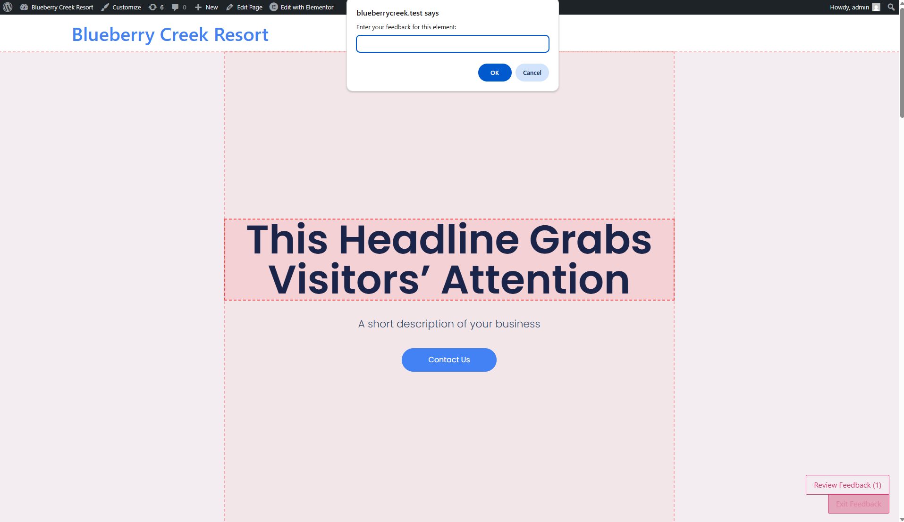

# WP Page Feedback

**Contributors:** johncrislasta  
**Tags:** feedback, annotation, frontend comments, page review, client feedback  
**Requires at least:** 6.0  
**Tested up to:** 6.7.2  
**Stable tag:** 1.0.2  
**License:** GPLv2 or later  
**License URI:** https://www.gnu.org/licenses/gpl-2.0.html

## 🎯 Description

WP Page Feedback allows clients or users to click on any element of a WordPress page and leave comments or feedback directly on it. Perfect for collecting design feedback, content reviews, or website QA.

### ✨ Features
- **Frontend Annotator** – Users can click on any part of the page to leave comments.
- **Admin Feedback Dashboard** – View all feedback neatly in the WordPress admin.
- **"Resolve" Feedback Button** – Mark feedback as resolved once addressed.
- **Review Mode** – Toggle feedback highlights on the frontend for review.
- **Page Filtering & Sorting** – Filter feedback by page or status (resolved/unresolved).
- **GitHub Auto-Updates** – Seamless updates when pushed to GitHub.

---

## 🚀 Installation

1. Upload the plugin folder to the `/wp-content/plugins/` directory.
2. Activate the plugin through the 'Plugins' menu in WordPress.
3. Use the **Page Feedback** menu in the WordPress Admin to review and resolve feedback.

---

## 🛠 Usage

- Visit any page and click on the buttons to enter **Review Mode** or **Start Feedback Mode**.
- In **Start Feedback Mode**, all elements can be clicked and commented.
- In **Review Mode**, all feedback highlights will appear.
- Admins can view, filter, and resolve feedback via the **Page Feedback** menu.

---

## 🛠 GitHub Auto-Update Setup (For Developers)
This plugin supports GitHub updates using [YahnisElsts/plugin-update-checker](https://github.com/YahnisElsts/plugin-update-checker).

- Push your code to GitHub
- Tag releases (`v1.0.0`, `v1.1.0`, etc.)
- WordPress will detect and notify of new plugin versions automatically

---

## 📌 Roadmap
- User notifications on new feedback
- Email summary of unresolved feedback
- Screenshot preview with feedback
- Support for Custom Post Types

---

## 🤝 Contributing
Pull requests are welcome. For major changes, please open an issue first to discuss what you would like to change.

---

## 📄 License
This plugin is licensed under the GPLv2 or later.

---

## 📸 Screenshots

1. **Frontend Feedback Form**
   

2. **Admin Feedback Dashboard**
   

3. **Review Mode with Highlights**
   

---

## 🧩 Changelog
### 1.0.0
- Initial release
- Frontend annotation tool
- Admin feedback review
- GitHub auto-updates integration

---

## 🙌 Support Development
If you love this plugin and want to support further development:

Thank you! ❤️

